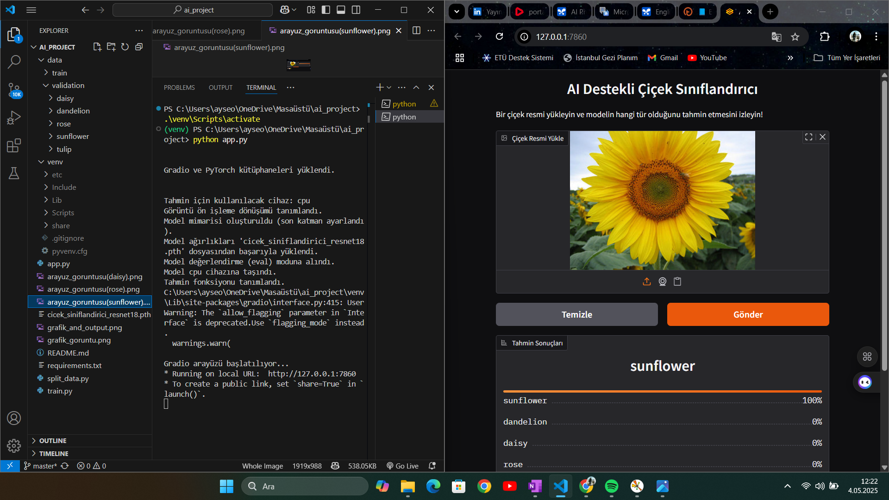

# Yapay Zeka Destekli Çiçek Sınıflandırıcı 🌸

## 1. Projeye Genel Bakış

Bu proje, görsel tanıma alanında pratik bir uygulama geliştirmeyi amaçlamaktadır. PyTorch kütüphanesi kullanılarak, ImageNet üzerinde önceden eğitilmiş bir ResNet18 modeli, 5 farklı çiçek türünü (papatya, karahindiba, gül, ayçiçeği, lale) içeren özel bir veri seti üzerinde ince ayar (fine-tuning) yöntemiyle eğitilmiştir. Eğitilmiş model, kullanıcıların web tarayıcıları üzerinden kolayca erişip çiçek resimleri yükleyerek tür tahmini yapabilmeleri için Gradio kütüphanesi ile oluşturulan interaktif bir web arayüzüne entegre edilmiştir.

**Projenin Temel Amacı:** Makine öğrenimi tekniklerini kullanarak, belirli bir görsel sınıflandırma problemini çözmek ve bu çözümü son kullanıcıya basit, anlaşılır ve işlevsel bir arayüzle sunmaktır.

## 2. Özellikler ve Yetenekler ✨

*   **Görüntü Yükleme:** Kullanıcılar, yerel disklerinden `.jpg`, `.png` gibi yaygın formatlardaki çiçek resimlerini yükleyebilirler.
*   **Otomatik Ön İşleme:** Yüklenen görüntüler, modelin beklediği formata getirilmek üzere otomatik olarak yeniden boyutlandırılır, kırpılır ve normalize edilir.
*   **Sınıflandırma:** Model, yüklenen görüntüyü analiz ederek 5 önceden tanımlanmış çiçek sınıfından hangisine ait olduğunu tahmin eder:
    1.  Papatya (Daisy)
    2.  Karahindiba (Dandelion)
    3.  Gül (Rose)
    4.  Ayçiçeği (Sunflower)
    5.  Lale (Tulip)
*   **Sonuç Gösterimi:** Tahmin edilen sınıf adı ve modelin her sınıf için hesapladığı olasılık değerleri, kullanıcı dostu bir etiket formatında gösterilir.
*   **İnteraktif Web Arayüzü:** Gradio ile geliştirilen arayüz, web tarayıcısı üzerinden kolay erişim ve kullanım imkanı sunar. Örnek resimlerle hızlı test imkanı sağlar.
*   **İnce Ayarlı Model:** Temel alınan ResNet18 modeli, ImageNet'ten öğrendiği genel görsel özellikleri çiçek tanıma görevine başarıyla aktarmıştır.

## 3. Kullanılan Teknolojiler ve Kütüphaneler 🛠️

*   **Programlama Dili:** Python 3
*   **Derin Öğrenme Kütüphanesi:** PyTorch
*   **Görüntü İşleme ve Model:** torchvision (ResNet18, Transforms, ImageFolder)
*   **Web Arayüzü:** Gradio
*   **Veri İşleme ve Metrikler:** NumPy, Scikit-learn (precision_score, recall_score)
*   **Görselleştirme:** Matplotlib (Eğitim grafiklerini çizmek için)
*   **Diğer:** Pillow (PIL - Görüntü okuma/işleme için)
*   **Ortam Yönetimi:** `venv` (Sanal ortam), `pip` (Paket yöneticisi)

## 4. Veri Seti Bilgileri 📊

*   **Adı:** Flowers Recognition
*   **Kaynak:** [Kaggle - Flowers Recognition](https://www.kaggle.com/datasets/alxmamaev/flowers-recognition)
*   **İçerik:** 5 sınıfa ait (daisy, dandelion, roses, sunflowers, tulips) yaklaşık 4000+ etiketli görsel.
*   **Hazırlık:** Veri seti, model eğitimi ve değerlendirmesi için `split_data.py` betiği kullanılarak rastgele bir şekilde Eğitim (%80) ve Doğrulama (%20) alt kümelerine ayrılmıştır. Bu işlem sonucunda proje dizininde `data/train` ve `data/validation` klasörleri oluşturulmuştur.

## 5. Kurulum ve Hazırlık Adımları ⚙️

Projeyi kendi bilgisayarınızda çalıştırmak için aşağıdaki adımları takip ediniz:

1.  **Depoyu Klonlama veya İndirme:**
    *   *(GitHub deposu oluşturulduktan sonra aşağıdaki komutları güncelleyebilirsiniz)*
    *   GitHub kullanıyorsanız:
        ```bash
        git clone <github_repo_linkiniz> # Bu linki kendi reponuzla değiştirin
        cd <proje_klasor_adiniz>
        ```
    *   Veya ZIP olarak indirip dosyaları bir klasöre çıkartın ve o klasöre gidin.

2.  **Veri Setini Ayarlama:**
    *   [Kaggle'dan](https://www.kaggle.com/datasets/alxmamaev/flowers-recognition) veri setini (`archive.zip`) indirin.
    *   İndirdiğiniz zip dosyasını **proje klasörünüzün dışındaki** bir yere çıkartın (örneğin, `Downloads/flowers`).
    *   Proje klasörünüzdeki `split_data.py` dosyasını bir metin düzenleyici ile açın.
    *   `SOURCE_DIR` değişkenini, az önce zip'ten çıkardığınız `flowers` klasörünün **tam yolu** ile güncelleyin (Windows için `r"C:\..."` formatını kullanın).
    *   `DEST_DIR` değişkeninin, proje klasörünüzün içindeki `data` klasörünü işaret ettiğinden emin olun (genellikle `r"C:\...<proje_klasor_yolu>\data"` gibi).
    *   Terminalde sanal ortamı aktive ettikten sonra şu komutu çalıştırın:
        ```bash
        python split_data.py
        ```
        *(Bu işlem `data/train` ve `data/validation` klasörlerini oluşturacak/dolduracaktır.)*

3.  **Sanal Ortam Kurulumu:**
    *   Proje ana dizininde terminali açın.
    *   `python -m venv venv` komutu ile sanal ortamı oluşturun.
    *   Sanal ortamı aktive edin:
        *   Windows: `.\venv\Scripts\activate`
        *   macOS/Linux: `source venv/bin/activate`
    *   *(Terminal başında `(venv)` görmelisiniz.)*

4.  **Bağımlılıkları Yükleme:**
    *   Aktif sanal ortamda şu komutu çalıştırın:
        ```bash
        pip install -r requirements.txt
        ```
    *   **GPU Notu:** Eğer CUDA destekli NVIDIA GPU kullanmak isterseniz ve PyTorch kurulumunda sorun yaşarsanız, [PyTorch'un resmi sitesinden](https://pytorch.org/get-started/locally/) sisteminize uygun CUDA versiyonu için verilen `pip install ...` komutunu çalıştırmanız gerekebilir.

## 6. Uygulamanın Kullanımı 🚀

Kurulum adımları tamamlandıktan sonra uygulamayı iki şekilde kullanabilirsiniz:

**A. Modeli Yeniden Eğitme (Opsiyonel):**

Eğer modeli kendi veri setinizle veya farklı ayarlarla eğitmek isterseniz:

1.  Sanal ortamın aktif olduğundan emin olun (`(venv)`).
2.  Terminalde şu komutu çalıştırın:
    ```bash
    python train.py
    ```
3.  Eğitim süreci başlayacak, her epoch sonunda metrikler yazdırılacak ve eğitim bittiğinde performans grafikleri (`grafik_goruntu.png` benzeri) gösterilecektir. Eğitilmiş model ağırlıkları otomatik olarak `cicek_siniflandirici_resnet18.pth` dosyasına kaydedilecektir.

**B. Web Arayüzünü Çalıştırma (Tahmin Yapma):**

Eğitilmiş modeli kullanarak tahmin yapmak için:

1.  Sanal ortamın aktif olduğundan emin olun (`(venv)`).
2.  Terminalde şu komutu çalıştırın:
    ```bash
    python app.py
    ```
3.  Terminalde `Running on local URL: http://127.0.0.1:XXXX` şeklinde bir adres belirecektir.
4.  Bu adresi kopyalayıp **web tarayıcınıza** yapıştırın.
5.  Açılan Gradio arayüzünde "Çiçek Resmi Yükle" alanına tıklayarak veya sürükleyerek bir resim yükleyin ya da sağlanan örnek resimlerden birini seçin.
6.  Modelin tahmin sonuçları (sınıf adı ve olasılıkları) arayüzde görünecektir.

## 7. Model Performansı ve Sonuçlar 📈

Model, ResNet18 mimarisi temel alınarak ve ImageNet üzerinde önceden eğitilmiş ağırlıklar kullanılarak, sağlanan çiçek veri seti üzerinde **15 epoch** boyunca ince ayara tabi tutulmuştur. Adam optimizer (lr=0.001) ve CrossEntropyLoss kullanılmıştır. Elde edilen en iyi **doğrulama seti (validation set)** performansı aşağıdaki gibidir (Epoch 13'te elde edilmiştir):

*   **En İyi Doğrulama Başarısı (Accuracy):** **%89.48** (0.8948)
*   **En İyi Doğrulama Precision (Macro Avg.):** **0.8944**
*   **En İyi Doğrulama Recall (Macro Avg.):** **0.8971**

*(Bu değerler, `train.py` betiğinin son çalıştırılması sonucunda elde edilmiştir.)*

Eğitim süreci boyunca metriklerin epoch'lara göre değişimi aşağıdaki grafiklerde görülebilir:


## 8. Uygulama Arayüzü Ekran Görüntüsü 📸



## 9. Olası Geliştirmeler ve Gelecek Çalışmalar 💡

*   **Hiperparametre Optimizasyonu:** Öğrenme oranı, batch boyutu, epoch sayısı gibi parametrelerle deneyler yaparak model performansı iyileştirilebilir.
*   **Gelişmiş Veri Artırma:** Daha fazla veya farklı veri artırma teknikleri (`torchvision.transforms` içinde veya Albumentations gibi kütüphanelerle) uygulanabilir.
*   **Farklı Modeller:** ResNet34, EfficientNet veya Vision Transformer (ViT) gibi daha büyük veya farklı mimariler denenebilir.
*   **Detaylı Değerlendirme:** Karışıklık matrisi (Confusion Matrix) oluşturularak modelin hangi sınıfları karıştırdığı analiz edilebilir. Scikit-learn'ün `classification_report` fonksiyonu ile sınıf bazında metrikler incelenebilir.
*   **Deployment:** Model, kalıcı bir web uygulaması olarak Hugging Face Spaces, Streamlit Cloud, Heroku, AWS/GCP/Azure gibi platformlara deploy edilebilir.
*   **Sınıf Sayısını Artırma:** Daha fazla çiçek türü içeren bir veri seti ile model yeniden eğitilebilir.

## 10. Lisans 📄

Bu proje MIT Lisansı altında lisanslanmıştır. Detaylar için depodaki `LICENSE` dosyasına bakınız (veya [MIT Lisans metnine](https://opensource.org/licenses/MIT) bakınız).

---

*Bu README dosyası, projenin anlaşılmasına ve kullanılmasına yardımcı olmak amacıyla hazırlanmıştır.*